  

    

  

    

  <h3 style="color: #fcee0a; font-family: monospace;">>_ DETECTED SIGNATURES</h3>
  
  

   

  <h3 style="color: #ff003c; font-family: monospace;">>_ PERFORMANCE METRICS</h3>

  

    

  

    root@nightcity:~$ logout 
    Connection closed. 
  

